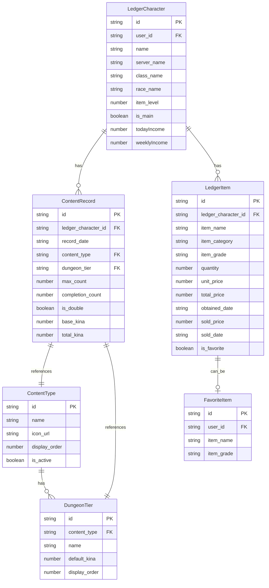

# 가계부 페이지 명칭 정리

## 📊 시각적 구조도

### 전체 페이지 구조

```mermaid
graph TD
    A[가계부 페이지 /ledger] --> B[메인 탭]
    B --> C[총합 대시보드]
    B --> D[캐릭터 탭들]
    B --> E[캐릭터 추가 버튼]

    C --> F[DashboardSummary]
    C --> G[CompactKinaOverview]
    C --> H[WeeklyChart]

    D --> I[서브탭]
    I --> J[컨텐츠 수입]
    I --> K[아이템]
    I --> L[주간 통계]

    J --> M[PremiumContentSection]
    J --> N[DailyContentSection]
    J --> O[ContentIncomeSection]

    K --> P[ItemManagementTab]
    K --> Q[FavoriteItemsPanel]

    L --> R[WeeklyChart]

    style A fill:#FACC15,stroke:#333,stroke-width:3px,color:#000
    style B fill:#60A5FA,stroke:#333,stroke-width:2px
    style I fill:#A78BFA,stroke:#333,stroke-width:2px
```



### 컴포넌트 계층 구조

```mermaid
graph LR
    A[LedgerPage] --> B[LedgerTabs]
    A --> C[LedgerSubTabs]
    A --> D[FloatingDateButton]
    A --> E[Modals]

    B --> B1[총합 탭]
    B --> B2[캐릭터 탭]
    B --> B3[추가 버튼]

    C --> C1[컨텐츠 수입]
    C --> C2[아이템]
    C --> C3[주간 통계]

    C1 --> D1[PremiumContentSection]
    D1 --> D1A[PremiumContentCard]

    C1 --> D2[DailyContentSection]
    D2 --> D2A[DailyContentCard]

    C1 --> D3[ContentIncomeSection]
    D3 --> D3A[ContentIncomeRow]

    C2 --> E1[ItemManagementTab]
    E1 --> E1A[EnhancedItemCard]
    C2 --> E2[FavoriteItemsPanel]

    C3 --> F1[WeeklyChart]

    E --> G1[AddCharacterModal]
    E --> G2[AddItemModal]
    E --> G3[DateSelectorModal]
    E --> G4[NicknameModal]
    E --> G5[MainCharacterModal]

    style A fill:#FACC15,stroke:#333,stroke-width:3px,color:#000
    style C1 fill:#A78BFA,stroke:#333,stroke-width:2px
    style C2 fill:#A78BFA,stroke:#333,stroke-width:2px
    style C3 fill:#A78BFA,stroke:#333,stroke-width:2px
```



### 데이터 흐름 (API → 컴포넌트)

```mermaid
graph TB
    A[API Endpoints] --> B[Custom Hooks]
    B --> C[Page Components]

    A1[/api/ledger/characters] --> B1[useLedgerCharacters]
    A2[/api/ledger/content-records] --> B2[useContentRecords]
    A3[/api/ledger/items] --> B3[useLedgerItems]
    A4[/api/ledger/stats/weekly] --> B4[useWeeklyStats]
    A5[/api/ledger/favorite-items] --> B5[useFavoriteItems]

    B1 --> C1[LedgerTabs]
    B2 --> C2[ContentIncomeSection]
    B2 --> C3[DailyContentSection]
    B2 --> C4[PremiumContentSection]
    B3 --> C5[ItemManagementTab]
    B4 --> C6[WeeklyChart]
    B5 --> C7[FavoriteItemsPanel]

    style A fill:#60A5FA,stroke:#333,stroke-width:2px
    style B fill:#A78BFA,stroke:#333,stroke-width:2px
    style C fill:#FBBF24,stroke:#333,stroke-width:2px
```

### 사용자 플로우

```mermaid
graph TD
    Start[사용자 방문] --> Auth{로그인 상태?}

    Auth -->|익명| Device[device_id 자동 생성]
    Auth -->|Google| Nick{닉네임 있음?}

    Nick -->|없음| NickModal[닉네임 설정 모달]
    Nick -->|있음| Main
    NickModal --> Main
    Device --> Main

    Main[메인 페이지] --> Tab{탭 선택}

    Tab -->|총합| Dashboard[DashboardSummary]
    Tab -->|캐릭터| SubTab{서브탭 선택}
    Tab -->|추가| AddChar[캐릭터 추가 모달]

    SubTab -->|컨텐츠| Content[컨텐츠 수입 입력]
    SubTab -->|아이템| Item[아이템 관리]
    SubTab -->|통계| Stats[주간 통계]

    Content --> Premium[프리미엄 컨텐츠]
    Content --> Daily[일일 컨텐츠]
    Content --> Income[컨텐츠 수입 행]

    Item --> ItemList[아이템 목록]
    Item --> Favorite[즐겨찾기]
    ItemList --> Sell[판매 처리]
    ItemList --> Delete[삭제]

    AddChar --> CharForm[캐릭터 정보 입력]
    CharForm --> Save[저장]

    style Start fill:#FACC15,stroke:#333,stroke-width:3px,color:#000
    style Main fill:#60A5FA,stroke:#333,stroke-width:2px
    style SubTab fill:#A78BFA,stroke:#333,stroke-width:2px
```



### API 엔드포인트 구조

```mermaid
graph LR
    API[/api/ledger/] --> A[characters]
    API --> B[content-records]
    API --> C[content-types]
    API --> D[daily-content]
    API --> E[premium-content]
    API --> F[items]
    API --> G[favorite-items]
    API --> H[stats]
    API --> I[auth]

    A --> A1[GET 목록]
    A --> A2[POST 추가]
    A --> A3[DELETE 삭제]

    B --> B1[GET 조회]
    B --> B2[POST 생성/수정]

    C --> C1[GET 타입 목록]

    D --> D1[GET 일일 컨텐츠]

    E --> E1[GET 조회]
    E --> E2[POST 생성]
    E --> E3[PATCH 수정]
    E --> E4[DELETE 삭제]

    F --> F1[GET 목록]
    F --> F2[POST 추가]
    F --> F3[PATCH 판매]
    F --> F4[DELETE 삭제]

    G --> G1[GET 조회]
    G --> G2[POST 추가]
    G --> G3[DELETE 제거]

    H --> H1[GET 통계]
    H --> H2[GET 주간통계]

    I --> I1[POST init]
    I --> I2[POST auth-init]
    I --> I3[PATCH nickname]

    style API fill:#FACC15,stroke:#333,stroke-width:3px,color:#000
    style A fill:#60A5FA,stroke:#333,stroke-width:2px
    style F fill:#60A5FA,stroke:#333,stroke-width:2px
    style H fill:#60A5FA,stroke:#333,stroke-width:2px
```



### 데이터 타입 관계도



---

## 1. 페이지 경로
- **URL**: `/ledger`
- **파일 위치**: `frontend/src/app/ledger/page.tsx`

---

## 2. 메인 탭 시스템 (Main Tabs)

### 2.1 총합 대시보드 탭
- **표시명**: "총합"
- **ID**: `dashboard`
- **아이콘**: LayoutDashboard
- **설명**: 모든 캐릭터의 통합 통계를 보여주는 대시보드

### 2.2 캐릭터별 탭
- **표시명**: 캐릭터 이름 (예: "이즈네")
- **ID**: 캐릭터 고유 ID (UUID)
- **구성 요소**:
  - 프로필 이미지
  - 캐릭터 이름
  - 서버명 (예: "베리트라")
  - 직업 (예: "소서러")
  - 종족 (천족/마족)
  - 아이템 레벨 (예: "IL1500")

### 2.3 캐릭터 추가 버튼
- **표시명**: "캐릭터 추가"
- **아이콘**: Plus
- **기능**: 새 캐릭터 추가 모달 열기

---

## 3. 서브탭 시스템 (Sub Tabs)

캐릭터 탭 선택 시 표시되는 하위 탭:

### 3.1 컨텐츠 수입
- **ID**: `content`
- **표시명**: "컨텐츠 수입"
- **섹션**:
  - **프리미엄 컨텐츠**: 일반 수입원 (일일 퀘스트, 제작, 판매 등)
  - **일일 컨텐츠**: 던전/인스턴스 수입 (단계별 키나 추적)

### 3.2 아이템 관리
- **ID**: `item`
- **표시명**: "아이템"
- **기능**:
  - 획득한 아이템 목록 관리
  - 판매 여부 추적
  - 아이템 등급별 필터링

### 3.3 주간 통계
- **ID**: `weekly`
- **표시명**: "주간 통계"
- **기능**: 최근 7일간의 수입 추이 차트

---

## 4. 주요 컴포넌트 (Components)

### 4.1 대시보드 관련
- **DashboardSummary**: 총합 대시보드의 통계 요약
- **CompactKinaOverview**: 간소화된 키나 현황 카드
- **WeeklyChart**: 주간 수입 추이 그래프

### 4.2 컨텐츠 수입 관련
- **PremiumContentSection**: 프리미엄 컨텐츠 섹션
  - **PremiumContentCard**: 개별 프리미엄 컨텐츠 카드
- **DailyContentSection**: 일일 컨텐츠 섹션
  - **DailyContentCard**: 개별 일일 컨텐츠 카드
- **ContentIncomeSection**: 컨텐츠 수입 입력 섹션
  - **ContentIncomeRow**: 개별 컨텐츠 수입 행

### 4.3 아이템 관리 관련
- **ItemManagementTab**: 아이템 관리 탭 전체
- **ItemSection**: 아이템 목록 섹션
- **EnhancedItemCard**: 향상된 아이템 카드
- **FavoriteItemsPanel**: 즐겨찾기 아이템 패널

### 4.4 탭 및 네비게이션
- **LedgerTabs**: 메인 탭 바 (총합/캐릭터/추가)
- **LedgerSubTabs**: 서브탭 바 (컨텐츠/아이템/주간통계)
- **FloatingDateButton**: 날짜 선택 플로팅 버튼

### 4.5 모달
- **AddCharacterModal**: 캐릭터 추가 모달
- **AddItemModal**: 아이템 추가 모달
- **DateSelectorModal**: 날짜 선택 모달
- **NicknameModal**: 닉네임 설정 모달
- **MainCharacterModal**: 대표 캐릭터 설정 모달

### 4.6 UI 유틸리티
- **CircularProgress**: 원형 진행 표시기

---

## 5. 데이터 타입 (Types)

### 5.1 캐릭터
```typescript
LedgerCharacter: 가계부 전용 캐릭터 데이터
- id: 고유 ID
- name: 캐릭터 이름
- server_name: 서버명
- class_name: 직업
- race_name: 종족
- item_level: 아이템 레벨
- is_main: 대표 캐릭터 여부
- todayIncome: 오늘 수입
- weeklyIncome: 주간 수입
```

### 5.2 컨텐츠
```typescript
ContentType: 컨텐츠 타입 정의
- id: 컨텐츠 ID
- name: 컨텐츠 이름
- icon_url: 아이콘 URL
- display_order: 표시 순서

DungeonTier: 던전 단계/난이도
- id: 단계 ID
- content_type: 컨텐츠 타입
- name: 단계명 (예: "일반", "어려움", "최고 난이도")
- default_kina: 기본 키나 보상

ContentRecord: 컨텐츠 완료 기록
- ledger_character_id: 캐릭터 ID
- record_date: 기록 날짜
- content_type: 컨텐츠 타입
- dungeon_tier: 던전 단계
- max_count: 최대 횟수
- completion_count: 완료 횟수
- is_double: 2배 보상 여부
- base_kina: 기본 키나
- total_kina: 총 획득 키나
```

### 5.3 아이템
```typescript
LedgerItem: 아이템 기록
- id: 고유 ID
- item_name: 아이템 이름
- item_category: 카테고리 (장비/재료/날개/기타)
- item_grade: 등급 (일반/희귀/영웅/전설/궁극)
- quantity: 수량
- unit_price: 개당 가격
- total_price: 총 가격
- obtained_date: 획득 날짜
- sold_price: 판매 가격
- sold_date: 판매 날짜
- source_content: 획득 컨텐츠
- is_favorite: 즐겨찾기 여부

ItemCategory: 'equipment' | 'material' | 'wing' | 'etc'
ItemGrade: 'common' | 'rare' | 'heroic' | 'legendary' | 'ultimate'
```

### 5.4 통계
```typescript
DailyStats: 일일 통계
- date: 날짜
- contentIncome: 컨텐츠 수입
- itemIncome: 아이템 수입
- totalIncome: 총 수입

WeeklyStats: 주간 통계
- startDate: 시작 날짜
- endDate: 종료 날짜
- dailyData: 일별 데이터 배열
- totalIncome: 총 수입
- averageIncome: 평균 수입
- bestDay: 최고 수입 날짜

LedgerSummary: 전체 요약
- totalIncome: 총 수입
- todayIncome: 오늘 수입
- weeklyIncome: 주간 수입
- unsoldItemCount: 미판매 아이템 수
- unsoldItemsByGrade: 등급별 미판매 아이템
```

---

## 6. API 엔드포인트

### 6.1 캐릭터 관리
- **GET** `/api/ledger/characters` - 캐릭터 목록 조회
- **POST** `/api/ledger/characters` - 캐릭터 추가
- **DELETE** `/api/ledger/characters/[id]` - 캐릭터 삭제

### 6.2 컨텐츠 기록
- **GET** `/api/ledger/content-records?characterId={id}&date={date}` - 컨텐츠 기록 조회
- **POST** `/api/ledger/content-records` - 컨텐츠 기록 생성/수정
- **GET** `/api/ledger/content-types` - 컨텐츠 타입 목록
- **GET** `/api/ledger/daily-content?characterId={id}&date={date}` - 일일 컨텐츠 조회

### 6.3 프리미엄 컨텐츠
- **GET** `/api/ledger/premium-content?characterId={id}&date={date}` - 프리미엄 컨텐츠 조회
- **POST** `/api/ledger/premium-content` - 프리미엄 컨텐츠 생성
- **PATCH** `/api/ledger/premium-content/[id]` - 프리미엄 컨텐츠 수정
- **DELETE** `/api/ledger/premium-content/[id]` - 프리미엄 컨텐츠 삭제

### 6.4 아이템 관리
- **GET** `/api/ledger/items?characterId={id}` - 아이템 목록 조회
- **POST** `/api/ledger/items` - 아이템 추가
- **PATCH** `/api/ledger/items/[id]/sell` - 아이템 판매 처리
- **DELETE** `/api/ledger/items/[id]` - 아이템 삭제

### 6.5 즐겨찾기
- **GET** `/api/ledger/favorite-items?userId={id}` - 즐겨찾기 아이템 조회
- **POST** `/api/ledger/favorite-items` - 즐겨찾기 추가
- **DELETE** `/api/ledger/favorite-items/[id]` - 즐겨찾기 제거

### 6.6 통계
- **GET** `/api/ledger/stats?characterId={id}&date={date}` - 통계 조회
- **GET** `/api/ledger/stats/weekly?characterId={id}` - 주간 통계 조회

### 6.7 인증
- **POST** `/api/ledger/init` - 가계부 초기화 (익명 사용자)
- **POST** `/api/ledger/auth-init` - 가계부 초기화 (Google 로그인)
- **PATCH** `/api/ledger/nickname` - 닉네임 설정

---

## 7. 용어 정리

### 7.1 한국어 용어
- **키나 (Kina)**: 아이온2의 게임 내 화폐
- **컨텐츠 수입**: 던전, 퀘스트 등에서 얻는 키나
- **아이템 수입**: 아이템 판매로 얻는 키나
- **프리미엄 컨텐츠**: 일반 수입원 (제작, 판매, 일일 퀘스트 등)
- **일일 컨텐츠**: 일일 제한이 있는 던전/인스턴스
- **2배 보상**: 프리미엄 또는 특별 이벤트로 인한 보상 2배
- **완료 횟수**: 해당 컨텐츠를 완료한 횟수
- **던전 단계**: 일반/어려움/최고 난이도 등의 난이도 선택

### 7.2 영어 용어
- **Ledger**: 가계부
- **Character**: 캐릭터
- **Content**: 컨텐츠
- **Record**: 기록
- **Item**: 아이템
- **Stats**: 통계
- **Dashboard**: 대시보드

### 7.3 아이템 등급 (한글 ↔ 영문)
- 일반 = common
- 희귀 = rare
- 영웅 = heroic
- 전설 = legendary
- 궁극 = ultimate

### 7.4 아이템 카테고리 (한글 ↔ 영문)
- 장비 = equipment
- 재료 = material
- 날개 = wing
- 기타 = etc

---

## 8. 주요 기능별 용어

### 8.1 컨텐츠 입력 시
- "횟수 증가/감소": 완료 횟수 조절 버튼
- "2배 토글": 보상 2배 활성화/비활성화
- "단계 변경": 던전 난이도 변경 (일반/어려움/최고)
- "최대 횟수": 일일 입장 가능 횟수

### 8.2 아이템 관리 시
- "판매 완료": 아이템을 판매한 것으로 표시
- "즐겨찾기": 자주 사용하는 아이템으로 등록
- "획득 날짜": 아이템을 얻은 날짜
- "판매 가격": 실제 판매된 가격

### 8.3 날짜 관련
- "오늘": 현재 날짜 (today)
- "선택된 날짜": 현재 보고 있는 날짜 (selected date)
- "기록 날짜": 데이터가 저장된 날짜 (record date)

---

## 9. 사용자 플로우별 명칭

### 9.1 첫 방문 시
1. **익명 사용자**: device_id로 자동 인증
2. **Google 로그인**: 닉네임 설정 모달 표시
3. **닉네임 설정 후**: 대표 캐릭터 설정 권장 (선택 사항)

### 9.2 캐릭터 추가 시
1. "캐릭터 추가" 버튼 클릭
2. **AddCharacterModal** 열림
3. 캐릭터 정보 입력:
   - 이름 (필수)
   - 서버 (필수)
   - 직업 (선택)
   - 종족 (선택)
   - 아이템 레벨 (선택)

### 9.3 컨텐츠 기록 시
1. 캐릭터 탭 선택
2. "컨텐츠 수입" 서브탭 선택
3. **프리미엄 컨텐츠** 또는 **일일 컨텐츠** 입력
4. 횟수, 단계, 2배 여부 조절
5. 자동으로 총 키나 계산 및 저장

### 9.4 아이템 기록 시
1. 캐릭터 탭 선택
2. "아이템" 서브탭 선택
3. "아이템 추가" 버튼 클릭
4. **AddItemModal**에서 정보 입력:
   - 아이템 이름 (필수)
   - 등급 (필수)
   - 카테고리 (필수)
   - 수량 (필수)
   - 가격 (선택)
   - 획득처 (선택)
5. 판매 시 "판매 완료" 버튼으로 판매 처리

---

## 10. 커스텀 훅 (Hooks)

- **useDeviceId**: 익명 사용자 device_id 관리
- **useLedgerCharacters**: 캐릭터 CRUD 작업
- **useContentRecords**: 컨텐츠 기록 CRUD 작업
- **useLedgerItems**: 아이템 CRUD 작업
- **useWeeklyStats**: 주간 통계 데이터
- **useFavoriteItems**: 즐겨찾기 아이템 관리

---

## 11. 스타일 파일

- **ledger.module.css**: 메인 가계부 스타일
- **CompactKinaOverview.module.css**: 키나 현황 카드
- **DailyContentCard.module.css**: 일일 컨텐츠 카드
- **DailyContentSection.module.css**: 일일 컨텐츠 섹션
- **DateSelectorModal.module.css**: 날짜 선택 모달
- **EnhancedItemCard.module.css**: 아이템 카드
- **FavoriteItemsPanel.module.css**: 즐겨찾기 패널
- **FloatingDateButton.module.css**: 플로팅 날짜 버튼
- **ItemManagementTab.module.css**: 아이템 관리 탭
- **LedgerSubTabs.module.css**: 서브탭 바
- **PremiumContentCard.module.css**: 프리미엄 컨텐츠 카드
- **PremiumContentSection.module.css**: 프리미엄 컨텐츠 섹션

---

## 12. 주요 색상 테마

프로젝트 전체 테마 (CSS Variables):
- **배경색**: `--bg-main: #0B0D12` (다크 모드)
- **강조색**: `--primary: #FACC15` (노란색)
- **텍스트**: `--text-main: #E5E7EB` (밝은 회색)

아이템 등급별 색상:
- **일반**: `#9CA3AF` (회색)
- **희귀**: `#60A5FA` (파란색)
- **영웅**: `#A78BFA` (보라색)
- **전설**: `#FBBF24` (금색)
- **궁극**: `#F472B6` (분홍색)

---

## 참고 사항

이 문서는 Claude Code와의 커뮤니케이션을 위한 명칭 정리 문서입니다.
가계부 기능 개발, 버그 수정, 기능 추가 시 이 문서의 용어를 사용하면
정확한 의사소통이 가능합니다.

**예시**:
- ❌ "아이템 목록 페이지 수정해줘"
- ✅ "아이템 서브탭의 EnhancedItemCard 컴포넌트 수정해줘"
- ✅ "일일 컨텐츠 섹션의 2배 토글 기능 추가해줘"
